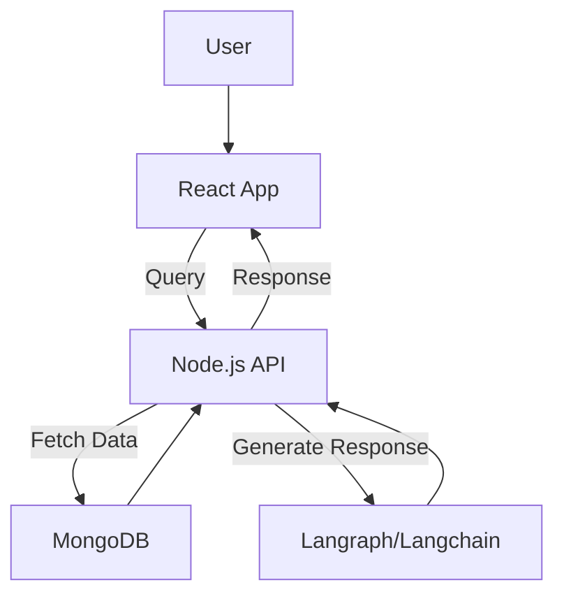

# Lost on Campus

Your witty college navigator! A playful, AI-powered virtual buddy that provides directions with humor and local slang.

## 🚀 Project Overview

**Lost on Campus** is a web-based interactive guide designed to help students find their way around college campuses with a touch of wit and humor. Instead of boring, static maps, our AI companion delivers directions in a quirky, engaging manner, making navigation more fun and memorable.

## 🎯 Features

- **Text & Voice Input** – Users can type or speak their queries (e.g., _"Where is the library?"_ or _"How to get to the computer lab?"_).
- **Humorous & Intelligent Directions** – AI-generated responses incorporate local slang and fun elements.
- **Campus Location Database** – Stores building names, common hangout spots, and fun facts.
- **Route Suggestions** – Offers alternative paths (shortest vs. scenic).
- **Interactive Map (Optional)** – Google Maps or OpenStreetMap integration.
- **User Feedback System** – Allows users to rate the helpfulness and humor of directions.

## 🏗️ Tech Stack

### **Frontend**

- React (or any modern JS framework)
- TypeScript (optional, for type safety)
- Google Maps/OpenStreetMap API (optional)

### **Backend**

- Node.js (Express)
- Langraph/Langchain for AI-powered responses
- REST API for processing user queries

### **Database**

- MongoDB
- Collections for:
  - Campus locations (name, coordinates, fun facts)
  - User feedback (ratings, session data)

### **DevOps & Deployment**

- GitHub (version control)
- Docker (for local development & deployment)
- AWS / Replit (optional for hosting)

## 📜 Architecture



## 📊 Database Schema

### **Campus Locations Collection**

| Field       | Type     | Description                         |
| ----------- | -------- | ----------------------------------- |
| \_id        | ObjectId | Primary key                         |
| name        | String   | Location name                       |
| description | String   | Short description                   |
| latitude    | Number   | GPS latitude                        |
| longitude   | Number   | GPS longitude                       |
| fun_fact    | String   | Interesting fact about the location |

### **User Feedback Collection**

| Field        | Type     | Description                         |
| ------------ | -------- | ----------------------------------- |
| \_id         | ObjectId | Primary key                         |
| direction_id | ObjectId | Foreign key (link to direction log) |
| rating       | Number   | Upvote/downvote                     |
| comment      | String   | User feedback                       |

## 🚦 Getting Started

### **1. Clone the Repository**

```sh
git clone https://github.com/yourusername/lost-on-campus.git
cd lost-on-campus
```

### **2. Install Dependencies**

#### Backend (Node.js example)

```sh
cd backend
npm install
```

#### Frontend (React example)

```sh
cd frontend
npm install
```

### **3. Set Up Database**

```sh
# Start MongoDB
mongod --dbpath /your/db/path
```

### **4. Run the Application**

#### Start Backend Server

```sh
cd backend
npm start
```

#### Start Frontend

```sh
cd frontend
npm start
```

## 🛠️ Future Enhancements

- Expand to multiple campuses.
- More AI personality customization.
- Gamification (e.g., leaderboard for best-rated directions).
- Real-time navigation assistance.

## 🤝 Contributing

1. Fork the repo
2. Create a feature branch (`git checkout -b feature-name`)
3. Commit changes (`git commit -m 'Add new feature'`)
4. Push to the branch (`git push origin feature-name`)
5. Open a pull request

## 📄 License

This project is licensed under the MIT License.

---

Made with ❤️ for lost students everywhere!
